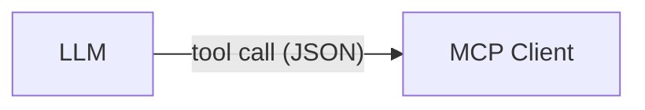
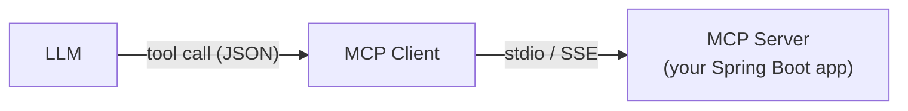
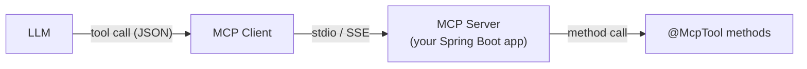
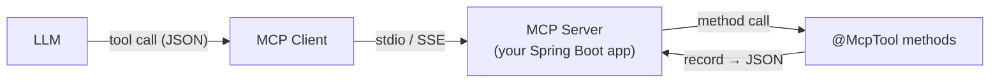
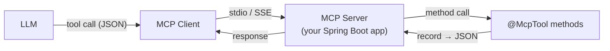
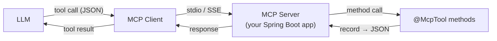
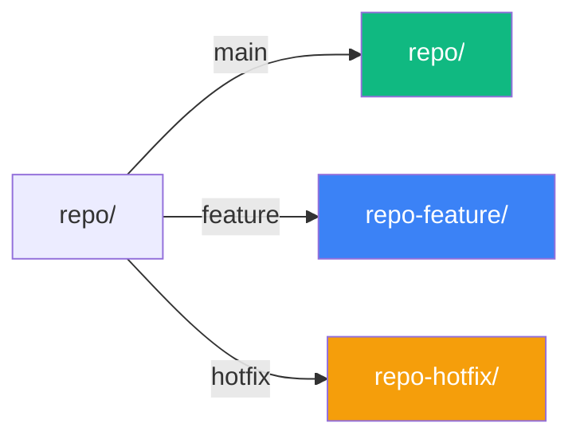
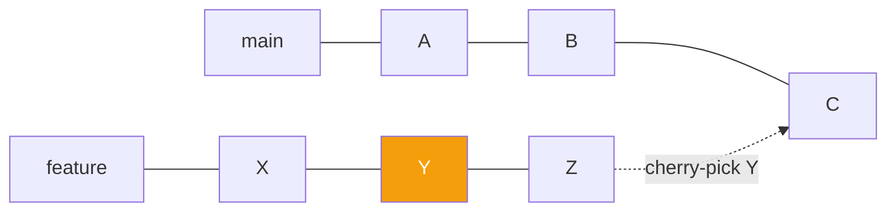
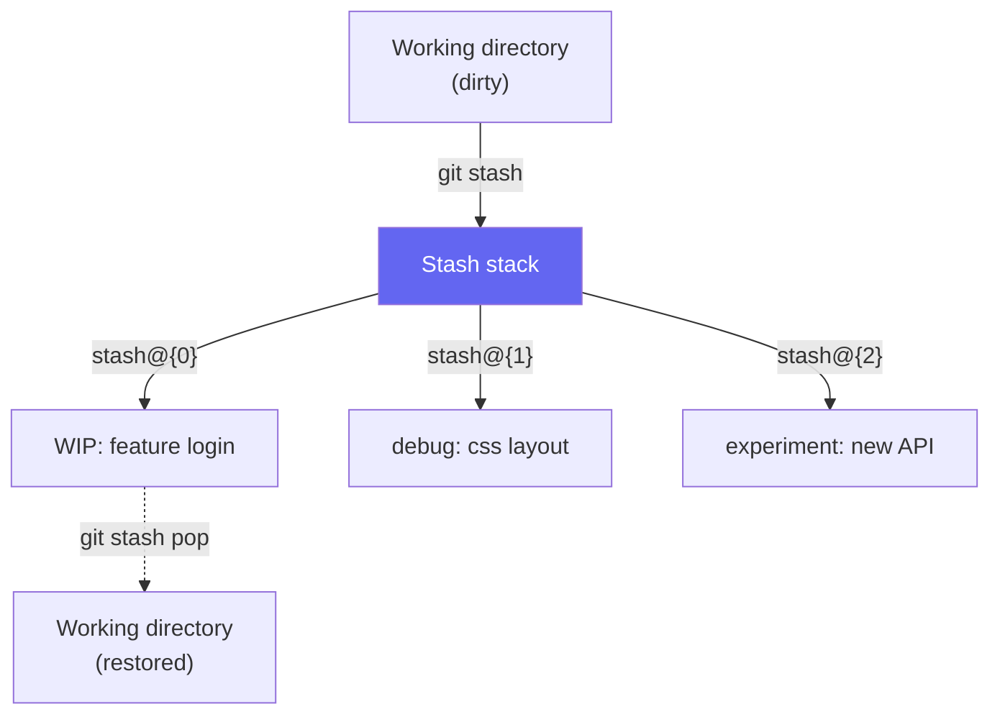
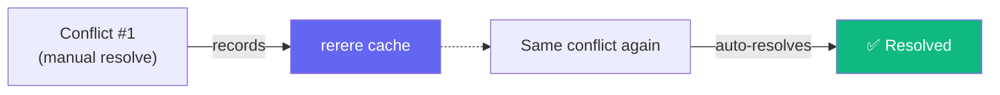

<style>
.slidev-layout, h1, h2, p, li {
  font-family: 'JetBrains Mono', monospace !important;
}
h1::before { content: "> "; color: #10b981; }
h2::before { content: "$ "; color: #3b82f6; }

.slidev-layout code,
.slidev-layout pre,
.slidev-layout pre code,
.slidev-layout .font-mono,
.slidev-code,
.shiki,
.shiki code,
.monaco-editor,
.monaco-editor * {
  font-family: 'Pragmasevka', ui-monospace, SFMono-Regular, Menlo, Monaco, Consolas, monospace !important;
}

/* Seriph theme dims secondary paragraphs — override to keep all text white */
.slidev-layout p {
  color: #e2e8f0 !important;
  opacity: 1 !important;
}
</style>

# Who knows git?

<!--
Audience warm-up. Show of hands — who uses Git daily? Everyone.
**→ Next:** Then let me tell you about my worst Git day.
-->

---
layout: center
class: text-center
---

# I lost 4 hours of work after accidental `git reset`

<v-click>

## Or my AI helped me with it

</v-click>

<!--
My story is everyone's story. Reset on the wrong branch, four hours gone.
**→ Next:** And it's not just reset — there's a whole panic playlist.
-->

---

# The Git Panic Moment

- "I lost my commits after a reset!"
- "Which commit broke the build?"
- "Who wrote this code???"
- "My PR history is a mess!"

**All** of them (and mode) are solvable

<!--
Start with the problem - every developer has been here.
Set up the emotional context before introducing the solution.
**→ Next:** Every one of these is solvable. Here's the promise.
-->

---

# The Promise: Git Zen

**What if**:
- AI could recover lost commits for you?
- AI could find the bug‑introducing commit (semi)automatically?
- AI could clean up your messy history?

<!--
**→ Next:** That's the promise. Now who's making it — quick intro.
-->

---
layout: cover
class: text-left
---

# From Git Panic to Git Zen

## With a Little Help from AI

### Pasha Finkelshteyn

#### <logos-twitter /> @asm0di0
#### <logos-firefox /> https://asm0dey.site

<!--
Now present the solution and yourself.
The title slide comes AFTER the problem for dramatic effect.
**→ Next:** Here's how we get from panic to zen — the roadmap.
-->

---
layout: center
class: text-center
---

# Three panics, three tools

## Reflog → Bisect → Interactive rebase

From the shortest tool we wrote to the gnarliest one.

<!--
**→ Next:** Before the tools, thirty seconds on the protocol that carries them — MCP.
-->

---
transition: none
---

# MCP in 30 seconds

AI models can't *just* run your code. 

They need a protocol to discover tools, call them, and get structured results back.

**Model Context Protocol (MCP)** is that protocol.



---
transition: none
---

# MCP in 30 seconds

AI models can't just run your code. They need a protocol to discover tools, call them, and get structured results back.

**Model Context Protocol (MCP)** is that protocol.



---
transition: none
---

# MCP in 30 seconds

AI models can't just run your code. They need a protocol to discover tools, call them, and get structured results back.

**Model Context Protocol (MCP)** is that protocol.



---
transition: none
---

# MCP in 30 seconds

AI models can't just run your code. They need a protocol to discover tools, call them, and get structured results back.

**Model Context Protocol (MCP)** is that protocol.



---
transition: none
---

# MCP in 30 seconds

AI models can't just run your code. They need a protocol to discover tools, call them, and get structured results back.

**Model Context Protocol (MCP)** is that protocol.



---
transition: none
---

# MCP in 30 seconds

AI models can't just run your code. They need a protocol to discover tools, call them, and get structured results back.

**Model Context Protocol (MCP)** is that protocol.




<div v-click>

We write the methods on the right. Spring AI + MCP handle everything in the middle.

</div>

<!--
**→ Next:** Protocol is clear. Here's the Spring Boot app that implements it.
-->

---

# The project at a glance

<div class="grid grid-cols-2 gap-8">
<div>

**Two dependencies**:

```xml {1-4|5-8}
<dependency>
  <groupId>org.springframework.ai</groupId>
  <artifactId>spring-ai-starter-mcp-server</artifactId>
</dependency>
<dependency>
  <groupId>org.eclipse.jgit</groupId>
  <artifactId>org.eclipse.jgit</artifactId>
</dependency>
```

</div>
<div v-click="2">

**stdio MCP server** — not a web app:

```yaml {none|1-3|1-4|7-10|7-9,13|7-9,14-15}
spring:
  main:
    web-application-type: none
    banner-mode: off
  application:
    name: git-mcp
  ai:
    mcp:
      server:
        stdio: true
        name: git
        version: 1.0.0
        type: SYNC
        annotation-scanner:
          enabled: true
```

</div>
</div>

<div v-click="7">

</div>

<!--
**→ Next:** Setup done. First panic — the one that ate my afternoon.
-->

---
transition: slide-up
---

# Panic #1: "I lost my commits after a reset"

You ran `git reset --hard HEAD~5` on the wrong branch. Your last afternoon of work
is gone from the log.

<div v-click>

**Except it isn't.** 

Git keeps every HEAD movement in the reflog for 90 days.

The commits are still in the object database, they're just not reachable from any ref.

</div>

<!--
Set up the stakes first. The "except it isn't" reveal is the emotional hinge:
from panic to relief.
**→ Next:** Git has an answer for this — but you need to remember it exists.
-->

---

# Git's answer: `git reflog`

```bash {none|1-4|6-7|9-10}
$ git log --oneline
abc1234 Some old commit        # ← your recent work is gone
# 😱 The last 5 commits vanished from the log!

$ git reflog
abc1234 HEAD@{0}: reset: moving to HEAD~5
def5678 HEAD@{1}: commit: Add user authentication

$ git reset --hard def5678 # or HEAD@{1}
# Your work is restored.
```

<div v-click>

Two commands, two seconds

</div>
<div v-click>

How good are you under pressure?

</div>

<!--
Reflog is a safety net, but it's only useful if you remember it and can read
the output correctly under stress. That's the opening for the AI tool.
**→ Next:** So let's wrap reflog in a tool the AI can call on your behalf.
-->

---

# Java + MCP: `GitReflogService`

<div/>

Our first look at the pattern. `@McpTool` on a Spring bean method,
`@McpToolParam` on every argument, and Spring AI does the rest of the wiring.

```java {none|1-8|10-13|14-21}{lines:true, maxHeight:'340px'}
public record ReflogEntryRecord(
        int index,
        String shortHash,
        String fullHash,
        String author,
        String timestamp,
        String message
) {}

@McpTool(name = "git_reflog",
    description = "List, show, and reset references "
                + "to previous states.")
public ReflogOperationResult gitReflog(
        @McpToolParam("Action: list, show, reset.") String action,
        @McpToolParam("Absolute path to the Git repo") String directory,
        @McpToolParam(value = "Git reference (default: HEAD).",
                required = false) String reference,
        @McpToolParam(value = "Entry index (0-based; negatives "
                + "count from end).", required = false) Integer index,
        @McpToolParam(value = "Max entries.",
                required = false) Integer limit) { ... }
```

<!--
First exposure to @McpTool. Keep it short: one record for the row shape, one
annotated method. The LLM reads the tool description and the @McpToolParam
text as its schema. We'll see the same shape applied to bisect on the next
cycle and dig into the details on the rebase cycle.
**→ Next:** Enough code. Watch the AI actually use it.
-->

---

# Live Demo: The Accidental Reset

**Goal**: Recover lost commits after a hard reset

**AI-assisted workflow**:
1. Ask AI: "I lost my work after a reset"
2. AI suggests checking reflog
3. AI helps interpret reflog output
4. AI recommends recovery command
5. You execute with confidence

```bash
# AI helps you understand:
$ git reflog
abc1234 HEAD@{0}: reset: moving to HEAD~5
def5678 HEAD@{1}: commit: Important feature work

# AI suggests:
$ git reset --hard def5678
```

**Result**: Work restored with AI guidance in seconds

<!--
First demo. The audience just saw the manual way, saw the tool code, and now
watches the AI use it. The arc is complete: panic → git answer → tool → AI demo.
**→ Next:** One arc closed. Second panic — and this one is stateful.
-->

---
transition: slide-up
---

# Panic #2: "Which commit broke the build?"

The login feature worked last Tuesday. It's broken today. Somewhere in the
last 40 commits someone introduced the bug, and the commit messages are
too vague to guess.

<!--
Second panic. Set up the "huge haystack, tiny needle" feeling.
**→ Next:** Git's answer is older than most of you — binary search.
-->

---

# Git's answer: `git bisect`

Binary search through history.

1. Mark a known-good commit (last Tuesday's tag).
2. Mark a known-bad commit (HEAD).
3. Git checks out the midpoint. You test it. You mark good or bad.
4. Repeat. In $\log_2(n)$ steps Git points at the culprit.

<!--
The manual flow in four beats. The magic-move visual on the next slide
hammers it home.
**→ Next:** Easier seen than described — let the animation do the talking.
-->

---

# Visual walkthrough:
````md magic-move
```
                                           [Bad]
    ○ ─── ● ─── ● ─── ● ─── ● ─── ● ─── ● ─── ●
   (A)   (B)   (C)   (D)   (E)   (F)   (G)   (H)
                                              🠝
                                              └─ Bug is found, but when did we introduce it???
```
```
[Good]                                     [Bad]
    ○ ─── ● ─── ● ─── ● ─── ● ─── ● ─── ● ─── ●
   (A)   (B)   (C)   (D)   (E)   (F)   (G)   (H)
    🠝
    └─ Certainly not on (A)
```
```
[Good]                                     [Bad]
    ○ ─── ● ─── ● ─── ● ─── ● ─── ● ─── ● ─── ●
   (A)   (B)   (C)   (D)   (E)   (F)   (G)   (H)
                      🠝
                      └─ [Checking D...]
```
```
[Good]                                     [Bad]
    ○ ─── ○ ─── ○ ─── ○ ─── ● ─── ● ─── ● ─── ●
   (A)   (B)   (C)  [Good] (E)   (F)   (G)   (H)
                      🠝
                      └─ (D) is good, so we assume [A, D] is good
```
```
[Good]                                     [Bad]
    ○ ─── ○ ─── ○ ─── ○ ─── ● ─── ● ─── ● ─── ●
   (A)   (B)   (C)  [Good] (E)   (F)   (G)   (H)
                                  🠝
                                  └─ [Checking F...]
```
```
[Good]                                     [Bad]
    ○ ─── ○ ─── ○ ─── ○ ─── ● ─── ● ─── ● ─── ●
   (A)   (B)   (C)  [Good] (E)  [Bad]  (G)   (H)
                                  🠝
                                  └─ (F) is bad, so it's in [E, F]
```
```
[Good]                                     [Bad]
    ○ ─── ○ ─── ○ ─── ○ ─── ● ─── ● ─── ● ─── ●
   (A)   (B)   (C)  [Good] (E)  [Bad]  (G)   (H)
                            🠝
                            └─ [Checking E...]
```
```
[Good]                                     [Bad]
    ○ ─── ○ ─── ○ ─── ○ ─── ○ ─── ● ─── ● ─── ●
   (A)   (B)   (C)  [Good][Good][Bad]  (G)   (H)
                            🠝
                            └─ (E) is good, so the bug was introduced in (F)
```
````

<!--
Walk the magic-move steps. Eight commits narrow to one in three checks.
**→ Next:** That's the intuition. Now the actual commands.
-->

---

# Commands
```bash
$ git bisect start
$ git bisect good abc123    # working login
$ git bisect bad def456     # broken login
# Git checks out midpoint automatically
$ ./run-login-test.sh       # test the feature
$ git bisect good           # test passed
# OR
$ git bisect bad            # test failed
# Repeat until found!
$ git bisect reset          # cleanup
```

<div v-click>

Find bugs in $O(\log_2(n))$ time instead of $O(n)$!

</div>

<!--
Binary search finds the culprit in log(n) steps.
Real-world use case: "the login feature broke last week".
**→ Next:** Bisect carries state between calls. Here's how we tool that.
-->

---

# Java + MCP: `GitBisectService`

<span class="text-sm opacity-80">Bisect is stateful, so we will put markers in git to remember what we che</span>

```java {all|1-10|12-14|15-19|20-31}{lines:true, maxHeight:'330px'}
public record BisectOperationResult(
        String action,
        String message,
        BisectStatus status,
        CommitDetails currentCommit
) {
    public record CommitDetails(String hash, String timestamp, String message) {}
    public record BisectStatus(String good, String bad,
                               String current, int skippedCount) {}
}

@McpTool(name = "git_bisect",
    description = "Find the commit that introduced a bug.")
public BisectOperationResult gitBisect(
        @McpToolParam("Action: start|good|bad|skip|reset|status|view")
        String action,
        @McpToolParam("Absolute path") String directory,
        @McpToolParam(value = "Known-good", required = false) String good,
        @McpToolParam(value = "Known-bad",  required = false) String bad) {
    try (Git git = openGitRepository(directory)) {
        return switch (action) {
            case "start"  -> startBisect(git, directory, good, bad);
            case "good"   -> markGood(git, directory);
            case "bad"    -> markBad(git, directory);
            case "skip"   -> markSkip(git, directory);
            case "reset"  -> resetBisect(git, directory);
            case "status" -> getStatus(directory);
            case "view"   -> getCurrentCommit(git);
            default -> throw new IllegalArgumentException(
                    "Unknown action: " + action);
        };
    }
}
```

<!--
Same @McpTool shape as reflog, applied to a stateful operation.
Java 25 switch expressions make the dispatch a one-liner per branch.
State lives in .git/bisect-state.json between calls.
**→ Next:** Watch AI drive the whole bisect loop — the hard thing chat-only can't do.
-->

---

# Live Demo: The Mysterious Bug

**Goal**: Find which commit broke the login feature

<div v-click>

**AI-assisted workflow**:
1. Ask AI: "Find the commit that broke login"
2. **AI analyzes** commit history and suggests bisect plan
3. **AI guides** executes `git bisect start --good abc123 --bad HEAD` for you
4. **You run** the test at each step and tell AI results
5. AI identifies the offending commit

</div>

<div v-click class="mt-4">

**AI suggestions**:
```bash
# Step 1: Start bisect
$ git bisect start
$ git bisect good abc123  # working commit
$ git bisect bad HEAD     # broken commit

# Step 2: Test & mark  
$ ./test-login.sh        # run your test
$ git bisect good # or bad
```

</div>

<!--
Second demo. The audience saw the manual bisect, the tool code, and now
the AI drives it. Stateful multi-step workflow — exactly the kind of thing
that's hard to do with chat-only AI.
**→ Next:** Two panics down, one left — and this one is the gnarliest.
-->

---
transition: slide-up
---

# Panic #3: "My pull request is a mess"

<v-clicks>

- Ten WIP commits. 
- Debug logs. 
- Typo fixes. 
- Reviewer says "please clean this up before I merge." 

</v-clicks>

<!--
Third panic. The fix is known but the tooling is sharp-edged.
**→ Next:** Git's answer: rewrite history before anyone else sees it.
-->

---

# Git's answer: interactive rebase

<div class="grid grid-cols-2 gap-8">
<div>

**Before: messy history**

```bash
# Too many small commits!
feat: Add user service
fix: typo in service name
wip: validation logic
debug: log user creation
fix: null pointer exception
feat: add email validation
wip: test coverage
debug: fix test flakes
fix: email regex bug
feat: finish user service
```

</div>
<div>

**After: clean history**
```bash
# 3 logical commits
feat: Implement user service
feat: Add email validation
fix: Fix validation bugs
```

</div>
</div>

<!--
Ten messy commits collapse to three logical ones. Before/after contrast.
**→ Next:** How does the tool actually describe the work? A plan file.
-->

---
transition: slide-up
---

<div class="grid grid-cols-2 gap-8">
<div>

**Before: messy history**

```bash
# Too many small commits!
feat: Add user service
fix: typo in service name
wip: validation logic
debug: log user creation
fix: null pointer exception
feat: add email validation
wip: test coverage
debug: fix test flakes
fix: email regex bug
feat: finish user service
```

</div><div>

**After: interactive rebase plan**

```bash
pick   abc123 feat: Implement user service
squash def456 fix: typo in service name
squash ghi789 wip: validation logic
squash jkl012 debug: log user creation
squash mno345 fix: null pointer exception
pick   pqr678 feat: Add email validation
squash stu901 wip: test coverage
squash vwx234 debug: fix test flakes
squash yza567 fix: email regex bug
pick   bcd890 feat: finish user service
```

</div>
</div>

<!--
Rewriting history without breaking the timeline.
The plan file is exactly the thing our tool will take as input.
**→ Next:** This is the biggest tool — let's go deep.
-->

---
layout: center
class: text-center
---

# Java + MCP: `GitInteractiveRebaseService`

This is the complex one. A validated plan, an optional dry‑run, an execute path.
Let's walk through it piece by piece.

<!--
Bridge slide. Signal that the rebase service is where we go deep, because it's
the richest example and the one where getting the details wrong hurts most.
**→ Next:** Start with the data shape — everything keys off this record.
-->

---

# First, the schema: a plain record

```java {all|2|3|4}{lines:true}
public record RebaseAction(
        String type,     // pick, reword, squash, fixup, drop, break
        String commit,   // required for everything except 'break'
        String message   // only for 'reword'
) {}
```

<div v-click>

The LLM sees this exact schema. Jackson handles serialization, so the field
names and types *are* the tool's contract.

</div>

<!--
Start with the data shape. Everything downstream keys off this record:
the @McpTool signature, the validation, the LLM's tool-call payload.
One record, zero boilerplate, full JSON round-trip.
**→ Next:** Record ready. Now register the method as a tool.
-->

---

# `@McpTool`: annotate the method

```java {all|1-5|6|7-10}{lines:true}
@McpTool(
    name = "git_interactive_rebase",
    description = "Perform interactive rebase: pick, reword, "
                + "edit, squash, fixup, drop, break."
)
public RebaseOperationResult gitInteractiveRebase(
        String directory,
        String upstream,
        List<RebaseAction> plan,
        Boolean dryRun) { ... }
```

<v-click>


</v-click>

<!--
Two things matter on this slide. The @McpTool name is what the LLM types when
it wants to call the tool. The description is what the LLM reads to decide
WHEN to call the tool. The method signature becomes the input schema automatically.
**→ Next:** But the LLM still needs to know what each parameter means.
-->

---

# But the LLM needs to know what each parameter means

<span class="text-sm opacity-80">Same method, now with an `@McpToolParam` description on every argument.</span>

````md magic-move {lines: true}
```java
public RebaseOperationResult gitInteractiveRebase(
        String directory,
        String upstream,
        List<RebaseAction> plan,
        Boolean dryRun) { ... }
```

```java
public RebaseOperationResult gitInteractiveRebase(
        @McpToolParam(description = "Absolute path to a local Git repo")
        String directory,
        @McpToolParam(description = "Upstream ref to rebase onto "
                + "(default: HEAD~1). Use '--root' for a root rebase.",
                required = false)
        String upstream,
        @McpToolParam(description = "Rebase plan — list of actions.")
        List<RebaseAction> plan,
        @McpToolParam(description = "If true, validate & emit todo "
                + "file without executing.", required = false)
        Boolean dryRun) { ... }
```
````

<v-click>

<span v-mark.underline.red>These descriptions are part of the prompt sent to the model.</span>

Write them like documentation for your future self *and* an LLM.

</v-click>

<!--
This is the one slide where Magic Move earns its keep: same method, annotations
growing in place. The audience sees exactly what was added.
The punchline is that every description string ends up in the LLM's context.
Bad descriptions lead to wrong tool calls.
**→ Next:** Schema done. Now inside the method — four patterns every body follows.
-->

---

# The body: validate, then dry‑run or execute

```java {all|1-2|4|6|7-11}{lines:true, maxHeight:'380px'}
if (upstream == null || upstream.isBlank()) upstream = "HEAD~1";
if (dryRun == null) dryRun = false;

validatePlan(directory, upstream, plan);

return dryRun
    ? new RebaseOperationResult("DRY_RUN",
            "Todo file generated.", null,
            generateTodoFile(directory, upstream, plan))
    : executeRebase(directory, upstream, plan);
```

<v-clicks>

- Normalise nullable optionals first. LLMs love to omit them.
- Validate before you touch the repo. Throw `IllegalArgumentException` with a human message and Spring AI will surface it back to the LLM.
- Honour `dryRun`. It returns the generated todo file without touching the repo, and it's the safety net that makes agents usable.
- Only run `executeRebase` once validation passed and `dryRun` is explicitly false.

</v-clicks>

<!--
Four things that every tool body in this project does the same way.
Normalise optionals. Validate hard and throw a readable message (Spring AI
forwards it to the LLM as a tool error). Offer a dry-run and document it,
because the LLM will use it. Keep the execute path tiny; it just delegates.
**→ Next:** Work done — what comes back? Structured records, not prose.
-->

---

# The return type: structured, not text

```java {all|1-6|8|9-13}{lines:true}
public record RebaseOperationResult(
        String status,    // SUCCESS, DRY_RUN, CONFLICTS
        String message,
        String newHead,
        String todoFile
) {}

// Returned as JSON automatically. No prompt parsing.
// The LLM sees typed fields and can branch on `status`
// without hoping a regex holds.
```

<v-click>

Records give the LLM a stable schema instead of free‑form prose.

<span v-mark.square.red="2">Typed output is what makes tool chaining reliable.</span>

</v-click>

<!--
Most chat-only integrations get this wrong. If your tool returns
"Rebase completed, new HEAD is abc123", the LLM has to parse English.
A record gives it a contract it can branch on without hoping a regex holds.
**→ Next:** Theory done. Watch the AI assemble a plan and execute it live.
-->

---
layout: two-cols
---

# Live Demo: The Messy PR

**Goal**: Clean up 10 messy commits into 3 logical commits

**AI-assisted workflow**:
1. Ask AI: "Clean up my PR history"
2. AI analyzes commits with `git_log`
3. AI generates rebase plan (squash, reword)
4. AI shows dry‑run plan for your review
5. You execute the validated plan

::right::

**Before**:
```
Add user service
fix typo
wip  
debug logs
finish user service
```

**AI calls `git_interactive_rebase`** with:
```json {all|2-3|4-5|7-8}{lines:true, maxHeight:'180px'}
[
  { "type": "pick",   "commit": "abc123" },
  { "type": "squash", "commit": "def456" },
  { "type": "squash", "commit": "ghi789" },
  { "type": "reword", "commit": "jkl012",
    "message": "feat: Implement user service" },
  { "type": "pick",   "commit": "mno345" },
  { "type": "squash", "commit": "pqr678" }
]
```

<span class="text-sm opacity-80">Matches the real <code>RebaseAction</code> record. Call it with <code>dryRun: true</code> first, then execute.</span>

<!--
Third demo. The arc closes: the audience saw the messy PR, the manual plan,
the deep code walkthrough, and now the AI assembles and executes the plan.
dry-run → confirm → execute is the human-in-the-loop pattern.
**→ Next:** Three arcs closed. Step back — patterns that apply beyond these tools.
-->

---
layout: center
class: text-center
transition: slide-up
---

# Beyond the tools

## Patterns worth stealing

<!--
Short pivot. The audience already knows the project setup and the MCP shape.
This section covers things they couldn't learn from the code alone.
**→ Next:** First pattern — the bootstrap, with a GraalVM twist.
-->

---

# Bootstrap: `main` plus AOT hints

```java {all|1-2|4-6|10|12|13-17|19-21|23-24}{lines:true, maxHeight:'380px'}
@SpringBootApplication
@ImportRuntimeHints(GithubMcpApplication.JGitRuntimeHints.class)
public class GithubMcpApplication {

    public static void main(String[] args) {
        SpringApplication.run(GithubMcpApplication.class, args);
    }

    // Native image: JGit uses reflection and ServiceLoader heavily.
    public static class JGitRuntimeHints implements RuntimeHintsRegistrar {
        @Override
        public void registerHints(RuntimeHints hints, ClassLoader cl) {
            Stream.of(
                    McpSchema.Tool.class,
                    GitBisectService.class,
                    GitInteractiveRebaseService.class,
                    GitInteractiveRebaseService.RebaseAction.class
                    /* ... */)
                .forEach(t -> hints.reflection().registerType(t,
                    MemberCategory.INVOKE_DECLARED_CONSTRUCTORS,
                    MemberCategory.INVOKE_DECLARED_METHODS));

            hints.resources().registerPattern(
                    "META-INF/services/org.eclipse.jgit.*");
        }
    }
}
```

<!--
The AOT hints are the price of running JGit under GraalVM native-image.
They are not required for the plain JVM build, but they let us ship a
~30MB native MCP binary that starts in under 50ms, which matters for
editor-embedded LLM tooling.
**→ Next:** Why does tool-calling beat chat-only? Here's the practical difference.
-->

---

# Tool‑calling vs Chat‑only AI

<div v-click>

**Chat‑only AI**:
- Can only suggest commands
- No validation, no safety checks
- Manual copy‑paste with risk

</div>

<div v-click class="mt-4">

**Tool‑calling AI**:
- Validates operations before suggestion
- Handles stateful workflows (bisect, rebase)
- Provides safety (dry‑run, confirmations)

</div>

<div v-click class="mt-4">

**What changes in practice**:
- AI reads the tool schema, plans a sequence, and executes it
- You stop copy-pasting commands from ChatGPT and hoping for the best

</div>

<!--
Tool‑calling enables validation and safety.
AI suggests validated commands instead of raw execution.
**→ Next:** Safety and visibility — the production concerns.
-->

---
layout: two-cols
---

# Security & Guardrails

**What AI guides you away from**:
- `git push --force` (destructive)
- Deleting branches without backup
- Risky operations without confirmation

**Implementation**:
- Tool‑level validation in Spring AI
- Dry‑run modes for dangerous operations
- Scope restrictions (directory, repository)

**Philosophy**: AI as expert guide, not autonomous agent

::right::

# Observability

**Monitor AI guidance patterns**:
- Spring Boot Actuator endpoints
- "Most‑suggested tools" metrics
- Error reduction statistics

**What you learn**:
- Which tools get called most (bisect wins, every time)
- Where the LLM retries or fails
- What to fix in your tool descriptions

<!--
Security through guidance, not execution.
Observability of AI assistance patterns.
**→ Next:** That's the deck. Let's wrap.
-->

---
layout: center
class: text-center
---

# Conclusion & Q&A

<!--
Pause marker. Breathe, pivot to takeaways.
**→ Next:** Three things I want you to walk out remembering.
-->

---

# Key Takeaways

<div v-click>

1. **Git already has the tools — you just need to remember they exist**
   - Reflog: your safety net
   - Bisect: binary search for bugs
   - Interactive rebase: clean up before you merge

</div>

<div v-click class="mt-4">

2. **AI handles the bookkeeping, you make the decisions**
   - It reads reflog output so you don't have to parse it under stress
   - It drives the bisect loop while you just run the test
   - It proposes a rebase plan; you approve before anything runs

</div>

<div v-click class="mt-4">

3. **One annotation, one record, and you have an MCP tool**
   - `@McpTool` + `@McpToolParam` is the whole API surface
   - Java records go in and out as JSON — no DTOs, no mapping
   - ~1200 lines for three non-trivial Git tools

</div>

<!--
Three clicks reveal each takeaway. Don't rush.
**→ Next:** Resources, contact, then questions.
-->

---
layout: center
class: text-center
---

# Thank You!

## Questions?

**Resources**:
- Spring Git MCP repository: [github.com/your-repo/spring-git-mcp](https://github.com/your-repo/spring-git-mcp)
- Model Context Protocol: [modelcontextprotocol.io](https://modelcontextprotocol.io)
- Spring AI documentation: [docs.spring.io/spring-ai](https://docs.spring.io/spring-ai)

**Contact**:  
me@asm0dey.site | <logos-twitter/> @asm0di0 | <logos-firefox/> https://asm0dey.site

<!--
Thanks. Pause for Q&A or pivot to bonus if time allows.
**→ Next:** If time — six more Git features that deserve MCP tools.
-->

---
layout: center
class: text-center
---

# Bonus: More Git Superpowers

## Ideas for your next MCP tools

<!--
Optional appendix. Pivot here only if time allows after Q&A.
**→ Next:** Start with worktree — parallel branches without stash juggling.
-->

---

# `git worktree` — parallel branches without stashing

Work on two branches at the same time in separate directories, no `stash` juggling.



**Panic it solves**: "I need to review a PR but I have uncommitted work"

<!--
Each worktree is a fully checked-out copy sharing the same .git.
An MCP tool could create/list/remove worktrees on demand.
**→ Next:** Cherry-pick — surgical transplant across branches.
-->

---

# `git cherry-pick` — surgical commit transplant

Copy a single commit from one branch to another without merging the whole branch.



**Panic it solves**: "I need *that one fix* from the feature branch in production — now"

<!--
Cherry-pick is simple in concept but conflict-prone in practice.
AI could analyze whether a commit applies cleanly before attempting it.
-->

---

# `git stash` — the pocket dimension

Temporarily shelve uncommitted changes and restore them later. Stashes stack.



**Panic it solves**: "I started working on the wrong branch and I can't commit yet"

<!--
Stash is well-known but managing multiple stashes is where people get lost.
AI could name, search, and selectively apply stashes.
-->

---

# `git blame` — line-level archaeology

Find who changed each line, when, and in which commit. The ultimate "why is this here?" tool.

```
$ git blame src/Auth.java
^abc123 (Alice  2025-03-01)  if (token == null) {
def4567 (Bob    2025-06-15)      throw new AuthException("expired");
^abc123 (Alice  2025-03-01)  }
ghi8901 (Carol  2025-09-22)  // TODO: refresh token logic
```

**Panic it solves**: "Who wrote this and what were they thinking?"

<!--
AI could correlate blame output with commit messages and PR descriptions
to give a full narrative of why a line exists.
-->

---

# `git rerere` — remember conflict resolutions

"**Re**use **re**corded **re**solution." Git memorises how you resolved a conflict and auto-applies it next time the same conflict appears.



**Panic it solves**: "I keep resolving the same merge conflict over and over during long-lived rebases"

<!--
rerere is one of the most underused Git features. AI could enable it,
explain cached resolutions, and flag when a cached resolution might be stale.
-->

---

# `git filter-repo` — full history surgery

Rewrite the entire repository history: remove large files, rename paths, strip secrets. The modern replacement for `filter-branch`.

```
# Remove accidentally committed credentials from ALL history
git filter-repo --path secrets.env --invert-paths

# Rename a directory across all commits
git filter-repo --path-rename old-name/:new-name/
```

**Panic it solves**: "Someone committed a 500MB binary / API key to the repo three months ago"

<!--
filter-repo is destructive and irreversible — exactly the kind of operation
where AI guidance (dry-run, impact preview) adds the most value.
-->
